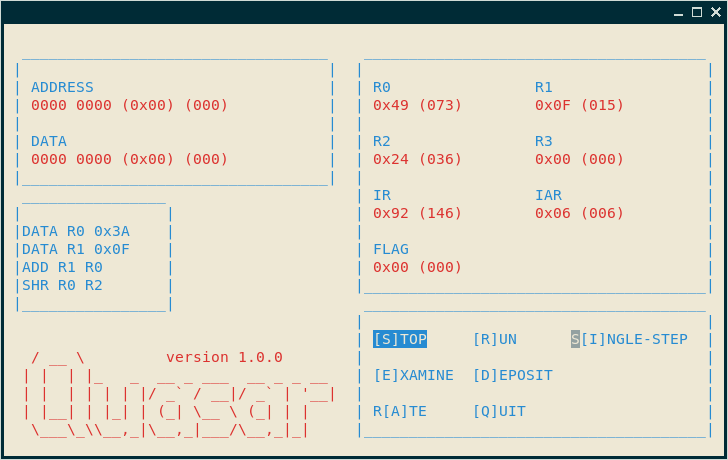
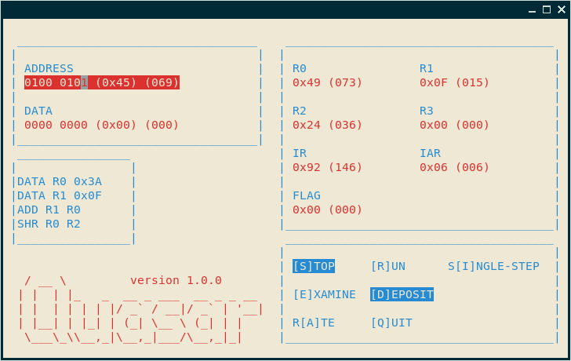

```
   ____                             
  / __ \                            
 | |  | |_   _  __ _ ___  __ _ _ __ 
 | |  | | | | |/ _` / __|/ _` | '__|
 | |__| | |_| | (_| \__ \ (_| | |   
  \___\_\\__,_|\__,_|___/\__,_|_|   
```
>QUite A Small ARchitecture

## Installation and Usage
Install with `make` (needs NCURSES library).

Run with `./quasar --test`.



Console interaction is done with keypad (LEFT/RIGHT, UP/DOWN) and ENTER key (e.g. move cursor to [Q]UIT button and press ENTER), or by pressing the letter of a console button (e.g. for [Q]UIT button press q or Q). When the EXAMINE/DEPOSIT functions are activated, pressing space will toggle the bit value at the position of the cursor (which can be moved with LEFT/RIGHT keys); when you've chosen a value press enter for it to be accepted.



See [README.txt](README.txt) for further details about installation, running, and also info on the system being emulated...

## To Do
- I've implemented the backend emulator and the console user-interface. They seem to be working, although the code is neither optimized nor particularly pretty. I need to double check the implementation of some of the emulation as well.

- The parser has not been fully implemented. Currently the system can be started from the command line with either no options (such that the memory is empty), or with the `--test` switch (such that a very simple program is loaded into memory at address 0), or with the path to a machine code script (e.g. test.qmc); if an assembly script is passed as an argument it will be ignored.
